<picture>
  <source media="(prefers-color-scheme: dark)" srcset="assets/header-dark.svg">
  
</picture>

  
  
  

I embed with enterprise teams to take GenAI from demo to production — private LLM applications, retrieval systems with grounded citations, and agents that use tools safely under governance. Nine years of data engineering underneath: the pipelines, migrations, and cost controls that make AI systems hold up once real traffic arrives.

| **50M+** | **95%** | **1B+/day** | **500+ TiB** | **$2M+** |
|:--|:--|:--|:--|:--|
| documents behind production RAG | grounded answer accuracy | events streamed at 99.9% uptime | migrated to cloud | infrastructure cost saved |

### The arc

Started in ETL, spent a decade making data platforms fast, cheap, and reliable at Schwab and HCA, then turned that foundation into applied GenAI. Every AI system I ship stands on pipelines I know how to build.

<picture>
  <source media="(prefers-color-scheme: dark)" srcset="assets/arc-dark.svg">
  
</picture>

### How I work

<picture>
  <source media="(prefers-color-scheme: dark)" srcset="assets/flow-dark.svg">
  
</picture>

### Now

- **Agent infrastructure** — MCP servers, multi-agent orchestration on Google ADK, A2A agents with eval harnesses and human-in-the-loop controls.
- **Portable agent tooling** — vendor-neutral foundations that work across Claude Code, Copilot, and Cursor.
- **Side project** — AI-generated options and equity signals.

### Selected work

| Project | What it does | Stack |
|:--|:--|:--|
| [**agentkit**](https://github.com/jthiruveedula/agentkit) | Portable, vendor-neutral agent foundation for Claude Code, Copilot, and Cursor | Python |
| [**agent-memory-mcp**](https://github.com/jthiruveedula/agent-memory-mcp) | Self-improving agent memory MCP server with a knowledge graph | TypeScript · MCP |
| [**dual-agent-platform**](https://github.com/jthiruveedula/dual-agent-platform) | Multi-agent orchestration for governed workflows with approval gates | LangGraph · Vertex AI |
| [**openclaw-gemma-pro**](https://github.com/jthiruveedula/openclaw-gemma-pro) | Private agent runtime — local Gemma, guardrails, fallback routing | Gemma · Ollama |
| [**rag-pipeline-gcp-vertexai**](https://github.com/jthiruveedula/rag-pipeline-gcp-vertexai) | Cloud-native enterprise RAG with grounded answers | Vertex AI · BigQuery |
| [**llmops-evaluation-framework**](https://github.com/jthiruveedula/llmops-evaluation-framework) | Automated eval, A/B testing, prompt versioning, drift detection | MLflow · LangSmith |
| [**LLM-SQL-Agent**](https://github.com/jthiruveedula/LLM-SQL-Agent) | Agent for Snowflake → BigQuery dialect migration with lineage validation | SQLGlot · LLMs |
| [**genai-data-platform**](https://github.com/jthiruveedula/genai-data-platform) | Multi-cloud and open-source learning suite for GenAI data platforms | Astro |

<b>More projects</b>

 

**RAG & knowledge** — [multimodal-rag-pipeline](https://github.com/jthiruveedula/multimodal-rag-pipeline) · [policy-sop-assistant](https://github.com/jthiruveedula/policy-sop-assistant) · [gdrive-rag-assistant](https://github.com/jthiruveedula/gdrive-rag-assistant) · [RAG-BigQuery-Chatbot](https://github.com/jthiruveedula/RAG-BigQuery-Chatbot) · [vector-db-benchmarking-suite](https://github.com/jthiruveedula/vector-db-benchmarking-suite)

**Agents for data** — [agentic-data-quality-guardian](https://github.com/jthiruveedula/agentic-data-quality-guardian) · [bigquery-cost-optimizer-agent](https://github.com/jthiruveedula/bigquery-cost-optimizer-agent) · [data-quality-ai-monitor](https://github.com/jthiruveedula/data-quality-ai-monitor) · [GenAI-DataPipeline-Orchestrator](https://github.com/jthiruveedula/GenAI-DataPipeline-Orchestrator) · [genai-powered-etl-codegen](https://github.com/jthiruveedula/genai-powered-etl-codegen)

**Platform & migration** — [databricks-cross-cloud-migration](https://github.com/jthiruveedula/databricks-cross-cloud-migration) · [snowflake-to-bigquery-migration-toolkit](https://github.com/jthiruveedula/snowflake-to-bigquery-migration-toolkit) · [real-time-llm-streaming-platform](https://github.com/jthiruveedula/real-time-llm-streaming-platform) · [gcp-dataproc-optimization-suite](https://github.com/jthiruveedula/gcp-dataproc-optimization-suite) · [llmops-mlflow-vertexai](https://github.com/jthiruveedula/llmops-mlflow-vertexai) · [intraday-ops-intelligence](https://github.com/jthiruveedula/intraday-ops-intelligence)

<b>Experience in detail</b>

 

| | Role | Highlights |
|:--|:--|:--|
| **2026** | Forward Deployed AI Architect · *John Wiley & Sons* | RAG over 50M+ documents at 95% grounded accuracy; multi-turn support agent with 60% ticket deflection; patterns adopted by 3 programs |
| **2024** | Forward Deployed Data Architect · *Definity* | GenAI translation of COBOL to BigQuery + PySpark across 12 workstreams, with a semantic-fidelity eval harness |
| **2024** | Forward Deployed Data Architect · *NRG Energy* | Directed AWS → GCP Databricks migration with near-zero downtime |
| **2022–24** | Lead Data Engineer · *HCA Healthcare* | GenAI accelerators that cut delivery timelines 50%; 100+ TB HIPAA migration to GCP |
| **2019–22** | Senior Data Engineer · *Charles Schwab* | Multi-PB Hadoop/Teradata → GCP migration, $1M+ saved; 1B+ daily records with zero data loss |
| **2015–19** | Data & ETL Engineer · *DSO MCS Group, InnoMinds* | Enterprise warehousing and reusable Talend frameworks |

### Toolkit

**LLMs & agents** — Claude, Gemini, GPT-4o, Llama · LangGraph, Google ADK, MCP, A2A, DSPy 
**Retrieval** — Vertex AI Vector Search, pgvector, Pinecone, Weaviate · hybrid search, reranking 
**Evaluation** — RAGAS, LangSmith, Langfuse, Arize Phoenix, LLM-as-judge 
**Data & cloud** — GCP (BigQuery, Dataflow, Pub/Sub), AWS, Databricks, Snowflake · Spark, Kafka, Airflow, dbt 
**Delivery** — Python, SQL, Terraform, Docker, Kubernetes, GitHub Actions · VPC-SC, CMEK, HIPAA / SOC 2

---

B.Tech, JNTU Hyderabad · Advanced Certificate in Blockchain & DLT, IIIT Hyderabad · Featured in the Free Press Journal (2025) · Open to GenAI architecture reviews, consulting, and open-source collaboration.
